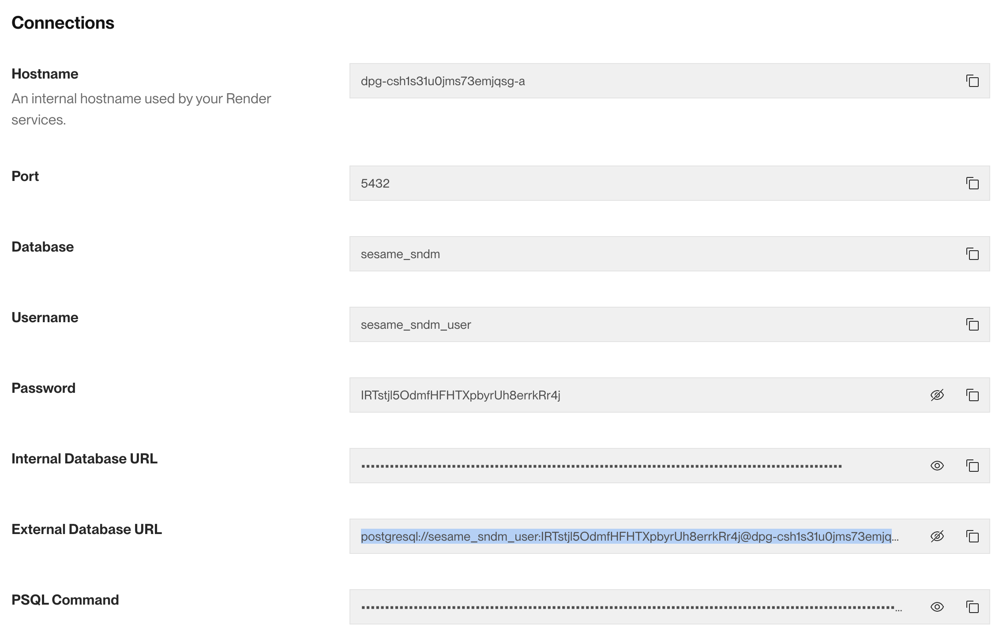

# Database Configuration

Open Sesame uses data storage for users, services, workspace settings, and conversation history. The current default schema assumes Postgres.

## Configuring using the CLI

The Open Sesame CLI tool provides commands to ease database setup:

```shell
# Initialize the database
cd ./sesame
python sesame.py init-db

# Run the schema migrations
python sesame.py run-schema
```

## Configuring manually via .env

You must set the non-optional `SESAME_DATABASE_*` variables in `sesame/.env`.

### Render (render.com)

You can create a new hosted Postgres database on your dashboard at [https://dashboard.render.com/new/database](https://dashboard.render.com/new/database)

Once you have created your database instance, navigate to it and obtain the credentials.



🛑: The Hostname property provided does not include the full database URL. You can access the full hostname by revealing the `External Database URL`.

Using these credentials, the database configuration in `.env` would look like this:

```bash
SESAME_DATABASE_ADMIN_USER="sesame_sndm_user"
SESAME_DATABASE_ADMIN_PASSWORD="*******"
SESAME_DATABASE_NAME="sesame_sndm"
SESAME_DATABASE_HOST="dpg-csh1s31u0jms73emjqsg-a.oregon-postgres.render.com"
SESAME_DATABASE_PORT=5432
```

### Supabase (supabase.com)

You can find your database credentials URL in the Supabase dashboard at: `https://supabase.com/dashboard/project/<YOUR-PROJECT-ID>/settings/database`. **Note: Be sure to use the URI for `Mode: session` to get the correct port for session mode.**


Your database credentials in `.env` should look something like this:

```bash
SESAME_DATABASE_ADMIN_USER="postgres.namespace"
SESAME_DATABASE_ADMIN_PASSWORD="password"
SESAME_DATABASE_NAME="postgres"
SESAME_DATABASE_HOST="region.pooler.supabase.com"
SESAME_DATABASE_PORT=5432
```

#### Configuring the User Role

Supabase appends schema namespaces to usernames. The CLI tool detects this and correctly removes them when running the schema. If you are applying the schema manually, please check:

- `%%USER%%` is replaced _without_ the namespace value, e.g., `sesame`
- `SESAME_DATABASE_NAME` includes the namespace, e.g., `sesame.namespace`
- `%%PASSWORD%%` is set to something secure

## Database Schema

Schema files to run on your database can be found in the [schema](./../schema/) folder in the root of this project.

You can run the schema using the Open Sesame CLI:

```shell
# Apply database schema migrations
cd sesame/
python sesame.py run-schema
```

🛑: The Open Sesame CLI will not create the database for you. If the database does not exist (if you are using a local psql, for example), please ensure to run:

```sql
CREATE DATABASE dbname;
```

Where `dbname` matches your `SESAME_DATABASE_NAME`.

If you do not want to use the CLI tool, you must replace `%%USER%%` and `%%PASSWORD%%` to align with your `SESAME_DATABASE_USER` and `SESAME_DATABASE_PASSWORD` .env values respectively.

## Testing Your Database Connection

Update `SESAME_DATABASE_USER` and `SESAME_DATABASE_PASSWORD` (public) in `sesame/.env` with the randomly generated password created by the `run_schema` script.

Alternatively, you can set this yourself in `database/schema.sql` by changing the `%%REPLACED%%` input near the bottom.

Optional: Test your connection by running:

```shell
PYTHONPATH=. pytest tests/ -s -v
```